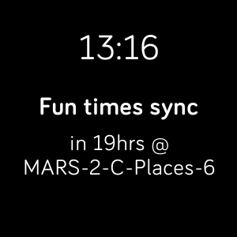

# sdk-calendar-clock

Fitbit SDK example application which demonstrates the Companion Calendar API.

The companion fetches calendar data using the Companion Calendar API and sends it to the
device using the File Transfer API. The application decides which event to display.

> Note: Only a subset of the calendar data is sent to the device, if you need to
> use different fields, then you need to include them in the file transfer.

Find out more information on the
[Fitbit Developer Website](https://dev.fitbit.com).

## License

This example is licensed under the [MIT License](./LICENSE).
